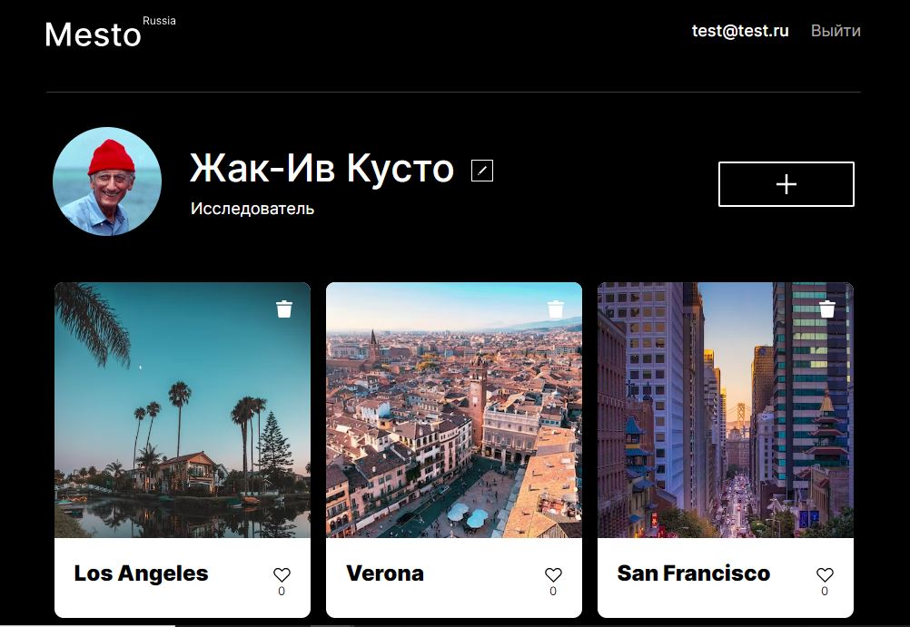
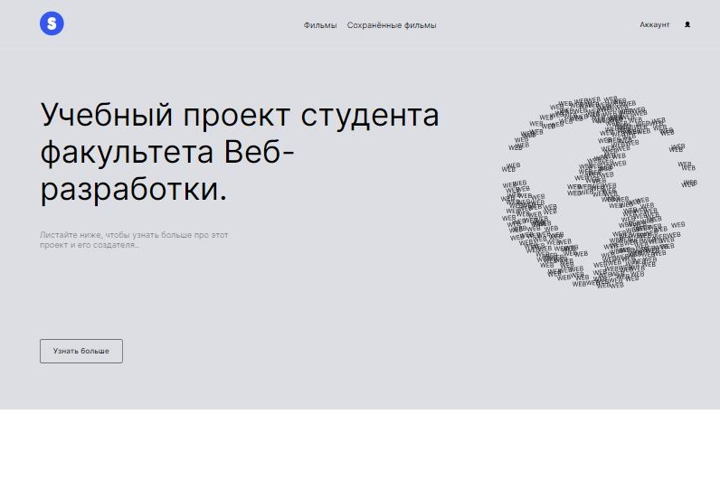
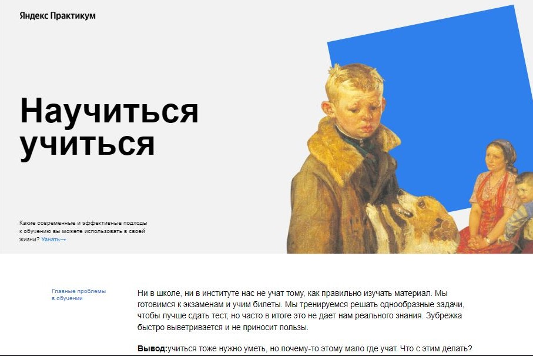

#    Hi there 👋

## About Me 👩‍💻

- I'm a junior Web.developer

- I’m currently learning more JavaScript, React, TypeScript

- How to reach me:

  
  
   

## Tech Stack 🛠️

## Projects 💻:

  
  
  
  
  
